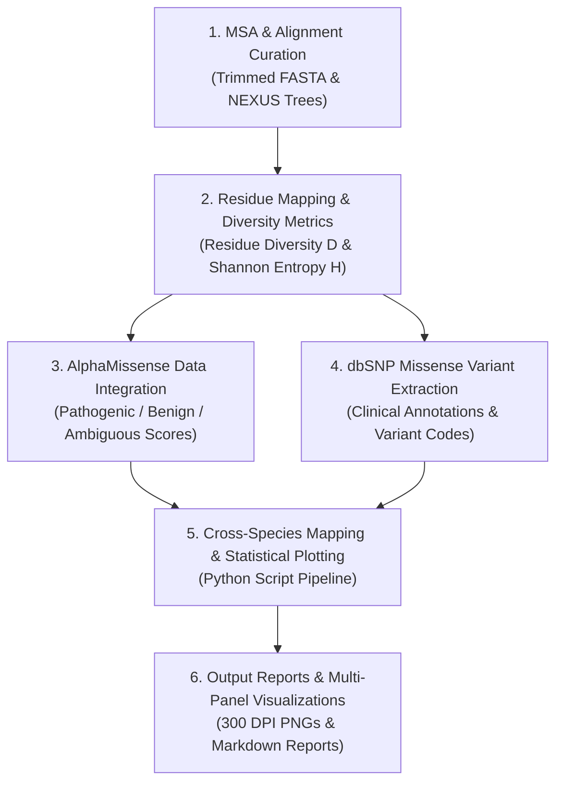

# 🧬 Evolutionary & Pathogenicity Analysis Workflow Report (/Evol)

## 📌 Introduction

The **`/Evol`** directory contains evolutionary conservation, residue diversity, machine-learning pathogenicity correlation, and cross-species variant analysis for key proteins involved in the creatine pathway:

1. **GATM (Glycine Amidinotransferase — UniProt `P50440`)**: The initial rate-limiting enzyme in creatine biosynthesis, converting L-arginine and glycine to guanidinoacetate (GAA).
2. **SLC6A8 (Creatine Transporter 1 — UniProt `P48029`)**: The primary transmembrane solute carrier responsible for creatine cellular uptake across cell membranes and the blood-brain barrier.

The core objective of this study is to determine how **evolutionary constraint** (measured across multi-species sequence alignments) correlates with **machine-learning pathogenicity predictions** (AlphaMissense) and **observed human clinical variants** (dbSNP / ClinVar).

---

## 🔄 Analysis Workflow

### **Stage 1: Multi-Species Alignment (MSA) & Diversity Metrics**
- **Input Datasets**: Trimmed Multiple Sequence Alignments (`.fasta`) covering distinct taxonomic scopes:
  - **GATM**: 4 alignments (`guest_4660`, `guest_4668` [415 seqs], `guest_4700`, `guest_4725` [371 seqs]) + phylogenetic trees (`.nex`).
  - **SLC6A8**: 6 alignments (`guest_4682` [200 seqs], `guest_4754` through `guest_4758` [up to ~800 seqs]) + phylogenetic trees (`.nex`).
- **Residue Mapping**: Alignment columns are mapped to 1-indexed human reference sequence positions (P50440 and P48029).
- **Calculated Metrics**:
  - **Residue Diversity ($D$)**: Number of unique non-gap amino acid residues at each position.
  - **Shannon Entropy ($H$)**: Measure of positional sequence variation across the MSA.

### **Stage 2: Integration of Deep Learning Pathogenicity (AlphaMissense)**
- Integrates AlphaMissense pathogenicity scores and categorical classifications (*Pathogenic*, *Benign*, *Ambiguous*) for all possible missense mutations (19 amino acid substitutions per site).
- Aggregates mean prediction counts and proportion distributions grouped by residue diversity levels ($D=1, 2, 3, \dots$).

### **Stage 3: dbSNP Human Missense Variant Cross-Species Mapping**
- Extracts known human missense variants from **dbSNP** (`P50440_missense_dbSNP_AAposAA.csv` & `P48029_missense_dbSNP_AAposAA.csv`) along with clinical significance annotations (*Pathogenic*, *Likely Pathogenic*, *VUS*, *Likely Benign*, *Benign*).
- Cross-references human variant residues against non-human orthologous species in the alignments to assess whether human mutations appear naturally in other organisms and at what frequencies.

### **Stage 4: Automated Visualization & Synthesis Reporting**
- Script executions (`plot_gatm_diversity_am.py`, `plot_slc6a8_diversity_am.py`, `plot_gatm_dbsnp_alignment_comparison.py`, `plot_dbsnp_alignment_comparison.py`) generate 300 DPI multi-panel comparative figures and structured markdown reports.

---

## 📊 Key Results Present in `/Evol`

| Protein | Conserved Sites ($D=1$) Pathogenicity Trend | Variable Sites ($D \ge 2$) Trend | dbSNP Cross-Species Findings |
| :--- | :--- | :--- | :--- |
| **GATM** (`P50440`) | **High Pathogenicity**: ~12.0 to 13.7 of 19 possible mutations per conserved site are predicted as *Pathogenic*. | **Dominant Benignity**: Proportion of benign predictions rises above 50–60%. | Benign human variants occur in up to 90%+ of non-human species; pathogenic variants are absent/extremely rare. |
| **SLC6A8** (`P48029`) | **Extreme Pathogenicity**: Average of **18.03** out of 19 possible substitutions predicted as *Pathogenic* in `guest_4682` ($D=1$). | **Rapid Shift to Benign**: Pathogenic density drops rapidly as sequence variation increases. | Clear negative selection; human pathogenic variants are filtered out across orthologous species. |

### Key Artifacts & Output Files in `/Evol`

- **Markdown Summary Reports**:
  - `gatm_diversity_alphamissense_report.md`
  - `slc6a8_diversity_alphamissense_report.md`
  - `evol_analysis_workflow_report.md`

- **Main Panel Visualizations**:
  - `GATM_all_alignments_diversity_vs_alphamissense.png` (Grid comparison across GATM MSAs)
  - `SLC6A8_all_alignments_diversity_vs_alphamissense.png` (Grid comparison across SLC6A8 MSAs)
  - `variantes_humanas_gatm_dbsnp_em_outros_organismos.png` & `variantes_humanas_dbsnp_em_outros_organismos.png` (4-panel dbSNP cross-species occurrence plots)
