# Creatine
Files for a bioinformatic analyses on creatine effects on kidney tissues.

[TOC]

# Creatine review
## Running Title
*Creatine effects on kidney tissues and renal function: new insights to old questions.*
## First Steps
### Creatine-related proteins on Stitch Database
Our first step was to use the term "*creatine*" in a search using the [Stitch Database](http://stitch.embl.de/) ([PUBMED](https://pubmed.ncbi.nlm.nih.gov/26590256/)), which list the known and predicted interactions between chemicals and proteins. The search was limited to the organism *Homo sapiens*. We found the proteins listed in the file [stitch_interactions-1st.tsv](stitch_interactions-1st.tsv). Then, using the advanced settings, we restricted the search for integration of RNA-Seq expression data from kidney tissues, using the [Human Protein Atlas](https://www.proteinatlas.org/) database. The file [stitch_interactions-2nd-ProteinAtlas.tsv](stitch_interactions-2nd-ProteinAtlas.tsv) contain the updated list, where the proteins AKT1, AKT2 and AKT3 appeared as a tissue-specific interactions. We also used the restriction from [Tissues Database](https://tissues.jensenlab.org/Search), using kidney as a term [stitch_interactions-3rd.tsv](stitch_interactions-3rd.tsv).
#### First observations
- The genes GATM and SLC6A8 were present in all three above searches.
- The genes from AKT family were present using expression data from the [Human Protein Atlas](https://www.proteinatlas.org/).
- The genes PSMB5, PSMD3, SGK1 and PRPS1 appeared when using expression data from the [Tissues Database](https://tissues.jensenlab.org/Search).

The first suggested protein list is ([Stitch-1st](Stitch-1st)):
```
SLC2A4
IGF1
GATM
SLC6A8
AKT1
AKT2
AKT3
PSMB5
PSMD3
SGK1
PRPS1
```
Since our aim is to review gene expression and protein alterations induced by creatine that are specific to renal tissues, we excluded the genes that are expected to interact with creatine, such as CK and CKMT. Interestingly, these genes were not found in the 3rd list (from Tissues database).

### Using the Comparative Toxicogenomics Database
Our second step was to perform searches using the [Comparative Toxicogenomics Database](https://ctdbase.org/). As a result, we obtained a list with 44 entries [CTD_gene_results_20240409072043.tsv](CTD_gene_results_20240409072043.tsv). After filtering the repetitive entries, we obtained the following gene list:

```
CKB
CKBE    Locus
CKBP1   Pseudogene
CKM
CKMT1A
CKMT1B
CKMT2
SLC16A12
SLC6A10P    Pseudogene
SLC6A10PB   Pseudogene
SLC6A8
```
Interestingly, three pseudogenes and one *locus* were retrieved. The informations from each gene symbol were obtained from [GeneCards](https://www.genecards.org/) database. The validated symbols were the following ones [CTD-genes-list-Edited-1st.tsv](CTD-genes-list-Edited-1st.tsv):

```
CKB
CKM
CKMT1A
CKMT1B
CKMT2
SLC16A12
SLC6A8
```
After that, we used the batch query tool from CTD, using NCBI gene symbols from the two above lists as a input. Then we got the following results:

- For [Stitch-1st](Stitch-1st) list:
    - Curated Gene/diseases associations: [CTD_gene_diseases_curated_1713265713318.tsv](CTD_gene_diseases_curated_1713265713318.tsv).
    - Inferred Gene/diseases associations: [CTD_gene_diseases_inferred_1713266126277.tsv](CTD_gene_diseases_inferred_1713266126277.tsv).
    - Curated Gene/pathways associations: [CTD_gene_pathways_curated_1713266155612.tsv](CTD_gene_pathways_curated_1713266155612.tsv).
    - Chemical/Genes interactions at the expression level: [CTD_gene_cgixns_1713266196128.tsv](CTD_gene_cgixns_1713266196128.tsv).
    - Curated Gene/Chemicals interactions: [CTD_gene_chems_curated_1713267587656.tsv](CTD_gene_chems_curated_1713267587656.tsv).
- For [CTD-genes-list-Edited-1st.tsv](CTD-genes-list-Edited-1st.tsv):
    - Curated Gene/diseases associations: [CTD_gene_diseases_curated_CTD-list.tsv](CTD_gene_diseases_curated_CTD-list.tsv).
    - Inferred Gene/diseases associations: [CTD_gene_diseases_inferred_CTD-list.tsv](CTD_gene_diseases_inferred_CTD-list.tsv).
    - Curated Gene/pathways associations: [CTD_gene_pathways_curated_CTD-list.tsv](CTD_gene_pathways_curated_CTD-list.tsv).
    - Chemical/Genes interactions at the expression level: [CTD_gene_cgixns_CTD-list.tsv](CTD_gene_cgixns_CTD-list.tsv).
    - Curated Gene/Chemicals interactions: [CTD_gene_chems_curated_CTD-list.tsv](CTD_gene_chems_curated_CTD-list.tsv).

#### Filtering CTD's results
We started filtering the inferred gene/diseases associations, since the curated ones are enriched to genetic diseases (inborn). For the Stitch-1st and CTD lists, we obtained a file with 153952 and 50868 rows, respectively. Then, we filtered the results using the presence of the terms `kidney` and `renal`, obtaining 2596 and 818 rows, for Stitch and CTD gene lists. The higher number of entries in the Stitch list is probably associated with the initial filtering process for expression in kidney tissues. The following table describes the number of entries per gene, in each list:

| Stitch |                   | CTD   |                   |
|:------:|:-----------------:|:-----:|:-----------------:|
| **Gene**   | **Number of entries** | **Gene**  | **Number of entries** |
| SLC2A4     |  283 | CKB      | 214 |
| IGF1       |  431 | CKMT1A   | 39  |
| GATM       |  172 | CKMT1B   | 37  |
| SLC6A8     |  157 | CKMT2    | 90  |
| AKT1       |  691 | SLC16A12 | 114 |
| AKT2       |  192 | SLC6A8   | 157 |
| AKT3       |  111 |       |                   |
| PSMB5      |  119 |       |                   |
| PSMD3      |  84  |       |                   |
| SGK1       |  268 |       |                   |
| PRPS1      |  109 |       |                   |

From the filtered files, we obtained the unique DiseaseIDs, and unique DiseaseIDs/gene.

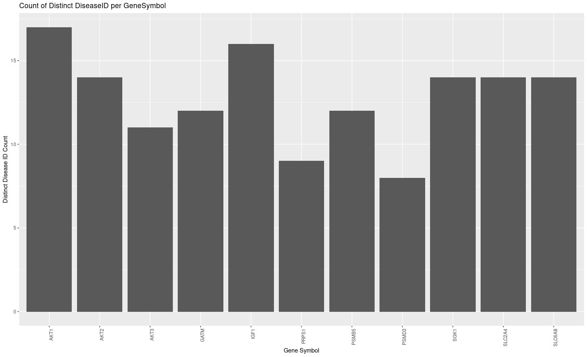
Stitch Genes with associated DiseaseIDs related to Kidney/Renal diseases
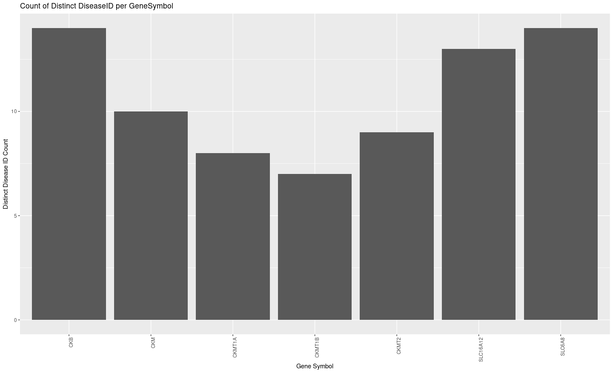
CTD Genes with associated DiseaseIDs related to Kidney/Renal diseases
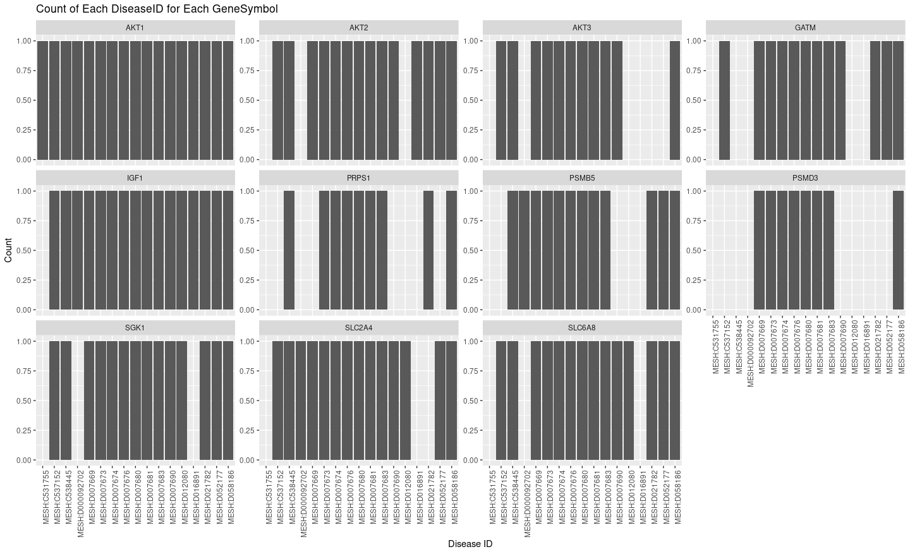
Presence/Absence of DiseaseID per gene from the Stitch-list
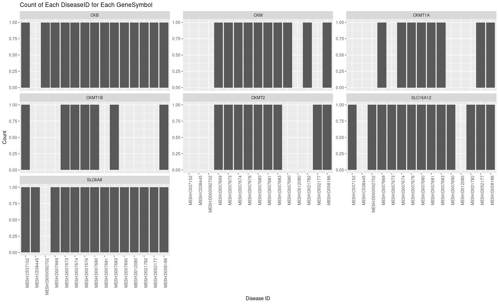
Presence/Absence of DiseaseID per gene from the CTD-list

Here are the number of DiseaseIDs and counts, common to the two genes lists:
```
DiseaseID      
MESH:D007676       77   Kidney Failure, Chronic
MESH:D007674       77   Kidney Diseases
MESH:D007680       77   Kidney Neoplasms
MESH:D007683       77   Kidney Tubular Necrosis, Acute
MESH:D058186       77   Acute Kidney Injury
MESH:D007681       66   Kidney Papillary Necrosis
MESH:D007673       66   Kidney Cortex Necrosis
MESH:D007669       60   Kidney Calculi
MESH:D052177       40   Kidney Diseases, Cystic
MESH:C537152       32   Hypomagnesemia 2, renal [Supplementary Concept]
MESH:D007690       32   Polycystic Kidney Diseases
MESH:D021782       32   Multicystic Dysplastic Kidney
MESH:D012080       10   Chronic Kidney Disease-Mineral and Bone Disorder
MESH:C538445        9   Clear-cell metastatic renal cell carcinoma [Supplementary Concept]
MESH:D000092702     8   Chronic Kidney Diseases of Uncertain Etiology
```
The list from the Stitch database has these unique DiseaseID counts:
```
DiseaseID
MESH:D016891    3   Polycystic Kidney, Autosomal Dominant
MESH:C531755    1   Kidney disorder involving deposition of calcium and oxalate or phosphate in the renal tubules [Supplementary Concept]
```

## Gene Expression

We merged the two above lists into one. 

```
SLC2A4
IGF1
GATM
SLC6A8
AKT1
AKT2
AKT3
PSMB5
PSMD3
SGK1
PRPS1
CKB
CKM
CKMT1A
CKMT1B
CKMT2
SLC16A12
```
The first step was to retrieve a general expression panel of these genes, for all tissues. For this we used the tool `Multi-Gene Query` of the [GTEx Portal](https://gtexportal.org/home/). The figure below describes the relative expression of these genes in transcripts per million (TPM).

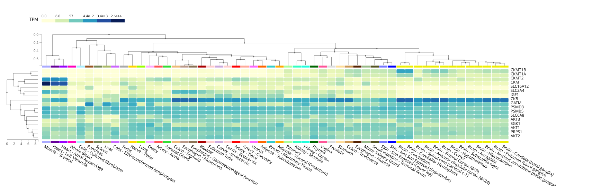
The general expression panel for all tissues of the 17 creatine-related genes used in the present study

We also highlighted the specific expression for kidney tissues:

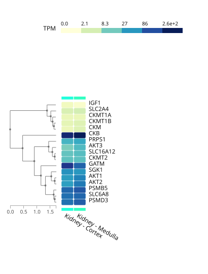
Kidney tissues expression levels of the 17 creatine-related genes used in the present study

And from pancreas tissues:

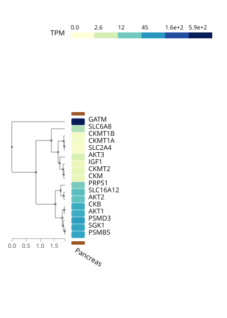
Pancreas expression levels of the 17 creatine-related genes used in the present study

### Important Information

As highlighted above, we noticed the following results from GTex database:

| CellTypes | P-value | adjusted P-value | OddsRatio | Combined Score | Genes |
|:---------:|:-------:|:----------------:|:---------:|:--------------:|:-----:|
| Pancreas Female 30-39 Up | 0.00320528834894988 | 0.0293818098653739 | 27.05442176870748 | 155.3722787250682 | GATM;SLC16A12 |
| Pancreas Female 20-29 Up | 0.00320528834894988 | 0.0293818098653739 | 27.05442176870748 | 155.3722787250682 | GATM;SLC16A12 |
| Pancreas Female 40-49 Up | 0.00320528834894988 | 0.0293818098653739 | 27.05442176870748 | 155.3722787250682 | GATM;SLC16A12 |
| Pancreas Female 60-69 Up | 0.00320528834894988 | 0.0293818098653739 | 27.05442176870748 | 155.3722787250682 | GATM;SLC16A12 |
| Pancreas Female 50-59 Up | 0.00320528834894988 | 0.0293818098653739 | 27.05442176870748 | 155.3722787250682 | GATM;SLC16A12 |
| Pancreas Male 20-29 Up | 0.00320528834894988 | 0.0293818098653739 | 27.05442176870748 | 155.3722787250682 | GATM;SLC16A12 |
 
 - *Why do pancreas cells have these genes upregulated?*
 - *In which conditions did these increased expression occur?*
 - *Is it probable that a creatine-induced high expression of GATM and SLC16A12 is associated with the observed improvement of creatine-supplmented streptozotocin-induced diabetic rats? How?* 

 #### Generative-IA search (From Copilot and Chat-GPT):

 >*Just to give us some ideas in an short text. Not for use in final texts and the listed references should be reviewed.*  

**Query:** *Write something about the importance of the genes GATM and SLC16A12, as well as their respective proteins, in pancreatic tissues or pancreatic cancer.*
**Combined answer:**
*GATM (Glycine Amidinotransferase) and SLC16A12 (Solute Carrier Family 16 Member 12) are two genes that have garnered attention in recent years due to their potential significance in pancreatic tissues and pancreatic cancer.*

**GATM Gene and Protein:** *GATM encodes the enzyme Glycine Amidinotransferase, which plays a crucial role in creatine biosynthesis. Creatine is essential for providing energy to cells, particularly those with high energy demands like muscle cells. While initially identified for its role in muscle metabolism, emerging research suggests that GATM may also be involved in pancreatic tissue function. Studies have indicated that GATM expression may be altered in pancreatic cancer cells, although the exact mechanisms and implications of this alteration are still being elucidated. Understanding the role of GATM in pancreatic tissues could provide insights into both normal pancreatic physiology and the pathological processes underlying pancreatic cancer.*
**SLC16A12 Gene and Protein:** *SLC16A12 belongs to the Solute Carrier Family of transporters and is involved in the transport of metabolites across cell membranes. Specifically, SLC16A12 encodes a monocarboxylate transporter involved in the transport of monocarboxylates such as lactate and pyruvate. While the role of SLC16A12 in pancreatic tissues is less well-characterized compared to GATM, there is evidence to suggest its involvement in various cancers, including pancreatic cancer. Dysregulation of monocarboxylate transporters like SLC16A12 can influence cellular metabolism, which is a hallmark of cancer cells.*

**GATM (Glycine Amidinotransferase)**:
*GATM plays a crucial role in the synthesis of guanidinoacetic acid (GAA), a metabolite associated with pancreatic ductal adenocarcinoma (PDAC) liver metastasis¹>[6]. High expression of GATM has been positively correlated with advanced N stage in PDAC¹[6]. Knockdown of GATM significantly reduced the intracellular level of GAA, suppressed epithelial-mesenchymal transition (EMT), and inhibited PDAC liver metastasis¹[6]. These findings suggest that GATM-mediated de novo GAA synthesis >promotes PDAC metastasis¹[6].*

**SLC16A12 (Solute Carrier Family 16 Member 12)**:
*The SLC16A family members, including SLC16A12, play crucial roles in tumorigenesis and tumor progression²[1]. However, the exact role of SLC16A12 in human pancreatic cancer remains unclear²[1]. The SLC16A family of monocarboxylate transporters (MCTs) is known to play an important role in cell metabolism, such as aerobic glycolysis and pH homeostasis²[1]. Current research progress on the MCT family, including SLC16A12, is mainly based on the findings of MCT1-4²[1]. These proteins exhibit broad substrate specificity and are also involved in the transport of other monocarboxylic metabolites²[1].*
*Please note that while these genes and their proteins have been associated with pancreatic cancer, the exact mechanisms and their potential as therapeutic targets are still under investigation. For more detailed information, please refer to the respective scientific research articles²[1]¹[6].*

*Understanding the significance of GATM and SLC16A12 in pancreatic tissues and pancreatic cancer could have several implications:*

- *Biomarkers: These genes and their respective proteins could serve as potential biomarkers for pancreatic cancer diagnosis, prognosis, or treatment response.*
- *Therapeutic Targets: Targeting the pathways involving GATM and SLC16A12 could offer novel therapeutic strategies for pancreatic cancer treatment.*
- *Molecular Mechanisms: Investigating the molecular mechanisms by which GATM and SLC16A12 contribute to pancreatic cancer development could provide insights into the underlying biology of the disease, potentially leading to the identification of new therapeutic targets or diagnostic tools.*

*Overall, while further research is needed to fully elucidate the roles of GATM and SLC16A12 in pancreatic tissues and pancreatic cancer, their importance in cellular metabolism and potential implications for cancer biology make them intriguing candidates for further investigation in the field of oncology.*

**References:**
[1]: https://www.nature.com/articles/s41598-020-64356-y.pdf.
[2]: https://www.mdpi.com/2072-6694/10/4/103. 
[3]: https://www.medrxiv.org/content/10.1101/2024.03.03.24303664v1.full.pdf. 
[4]: https://columbiasurgery.org/pancreas/genetics-pancreatic-cancer. 
[5]: https://link.springer.com/article/10.1007/s11605-022-05553-0. 
[6]: https://jeccr.biomedcentral.com/articles/10.1186/s13046-023-02698-x. 
[7]: https://www.nature.com/articles/s41392-023-01662-7.pdf. 
[8]: https://www.nebraskamed.com/cancer/pancreatic/the-role-that-genes-play-in-pancreatic-cancer. 
[9]: https://doi.org/10.3390/cancers10040103.

## Gene enrichment analyses

We also used the final list as input for a gene enrichment analysis (GEA), using enrichR and enrichR-KG.

### Gene Ontologies (GO)

Our first analysis was against the GO dataset to verify the terms associated to these 17 genes. The resulted network from the top ten P-value rated results is described in the figure beloHere is the gene table with DEs values, when comparing Tumor x Normal samples. Give me the DE of the genes related to Creatine Metabolismw:

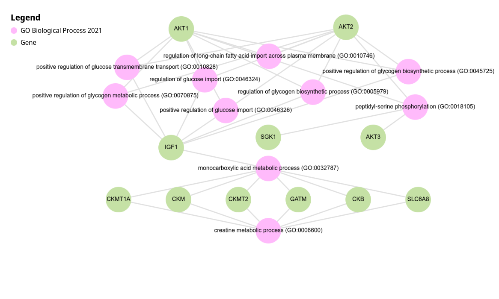

From the above figure one can note that the only direct integration of the creatine metabolism to all other proccess is the gene IGF1, which also participates in several carbohydrate-metabolism-related terms. Increasing the number of results to the top 30 rated results did not retrieved any other gene integration between creatine metabolism and other terms.

### Cell-types analysis

The first filter used was CellTypes enrichment analysis. As a selection criterion, we chose the databases where the words "kidney" or "renal" were present with associated terms (P-value<0.05), from the all tested databases. Using the `.tsv` tables as input, we executed the following command:

```
awk -F'\t' '$1 ~ /Kidney/ && $3 < 0.05 {print $1, $3, $4, $7, $8, $9}' listName
```
We also searched against Kidney cell lines:
- **ARCHS4 cell-lines database**: 293F, FLPIN TREX 293, and HEK293.

Only three databases retrieved results within the selection criteria. The table below describes the terms and their associated values:

| Database | CellTypes | P-value | adjusted P-value | OddsRatio | Combined Score | Genes |
|:--------:|:---------:|:-------:|:----------------:|:---------:|:--------------:|:-----:|
| **CellMarker 2024** | Collecting Duct Intercalated Cell Kidney Mouse | 0.003593 | 0.07843 | 25.49 | 143.46 | CKMT1B, SGK1 |
| **HuBMAP ASCTplusB augmented 2022** | Kidney Interstitial fibroblast - Kidney | 8.808317003142788E-5 | 0.0013050178709848516 | 42.18246110325318 | 393.86730230343085 | GATM, SLC16A12, IGF1 |
| | Connecting Tubule Intercalated Cell Type A - Kidney | 0.0033964046824717384 | 0.022655611815195546 | 26.246864686468648 | 149.2144192699383 | CKMT2, SLC16A12 |
| | Kidney Outer Medulla Collecting Duct Intercalated cell - Kidney | 0.0034612740273215416 | 0.022655611815195546 | 25.988235294117647 | 147.2524218660231 | CKMT2, SLC16A12 |
| **MoTrPAC 2023** | T59-Kidney Consensus | 0.0027283289091587022 | 0.024323568734636137 | 12.568017057569296 | 74.20240192548566 | SLC2A4, IGF1, CKB|
| | T59-Kidney Female 4W Up | 0.004243143988996933 | 0.026702092577683224 | 312.171875 | 1705.2235013634931 | SLC2A4 |
| **ARCHS4 cell-lines database** | HEK293 | 0.04417020235184285 | 0.8857370659521143 | 3.0671199442119943 | 9.568509033514891 | PRPS1, CKMT1A, AKT3, CKMT1B, CKB |
| **ProteomicsDB_2020** | Renal SN-12C BTO:0004221 P0001751 | 0.04134985878495573 | 0.44706319361150326 | 6.841535776614311 | 21.794986607296053 | PRPS1, AKT1 |
| **ARCHS4 Tissues** | KIDNEY (BULK TISSUE) | 2.952357524640197E-4 | 0.025095038959441675 | 6.807240516079338 | 55.327456253044275 | PRPS1, SLC6A8, PSMB5, CKMT1A,PSMD3, CKMT1B, SLC2A4, CKB |
| **GTexGTEx Tissue Expression Up** | GTEX-XPVG-0526-SM-4B65N kidney male 50-59 years | 0.03125629534977868 | 0.264210273152955 | 3.915257819103973 | 13.568460938462728 | GATM, SLC6A8, SLC16A12, SGK1 |

### Pathways and regulation

For the pathways enrichment analysis we used the results of just three databases: Reactome, Elsevier Pathway Collection, and KEGG. We also retrieved the analyses against kinases-regulation and PPI Hub proteins datasets in order to estimate the general regulation of the proteins coded by the creatine-related genes from our list. The inclusion criteria was the same for all analysis: the first 10 results, ordered by P-value<=0.05.

#### ReactomeDB

It generated the following results:

| Term | P-value | adjusted P-value | OddsRatio | Combined Score | Genes |
|:---------:|:-------:|:----------------:|:---------:|:--------------:|:-----:|
| Creatine Metabolism [R-HSA-71288](https://reactome.org/content/detail/R-HSA-71288) | 2.9184899635801106E-17 | 7.033560812228066E-15 | 2724.409090909091 | 103726.10102698307 | CKMT2;GATM;SLC6A8;CKM;CKMT1A;CKB |
| Metabolism Of Amino Acids And Derivatives [R-HSA-71291](https://reactome.org/content/detail/R-HSA-71291) | 2.3490852446193955E-10 | 2.8306477197663716E-8 | 49.006242197253435 | 1086.5578227282188 | CKMT2;GATM;SLC6A8;PSMB5;CKM;CKMT1A;PSMD3;CKB |
| Regulation Of PTEN Stability And Activity [R-HSA-8948751](https://reactome.org/content/detail/R-HSA-89487551) | 2.173230381584124E-9 | 1.7458284065392463E-7 | 133.877688172043 | 2670.4650899604635 | PSMB5;AKT2;AKT3;PSMD3;AKT1 |
| Cyclin E Associated Events During G1/S Transition [R-HSA-69202](https://reactome.org/content/detail/R-HSA-69202) | 6.09405957169532E-9 | 3.3201285234231814E-7 | 107.71645021645021 | 2037.5591352243764 | PSMB5;AKT2;AKT3;PSMD3;AKT1 |
| Cyclin A:Cdk2-associated Events At S Phase Entry [R-HSA-69656](https://reactome.org/content/detail/R-HSA-69656) | 6.888233451085438E-9 | 3.3201285234231814E-7 | 104.9789029535865 | 1972.915887374166 | PSMB5;AKT2;AKT3;PSMD3;AKT1 |
| KEAP1-NFE2L2 Pathway [R-HSA-9755511](https://reactome.org/content/detail/R-HSA-9755511) | 1.6664329868330147E-8 | 6.693505830445942E-7 | 87.2280701754386 | 1562.2543301775686 | PSMB5;AKT2;AKT3;PSMD3;AKT1 |
| Regulation Of TP53 Degradation [R-HSA-6804757](https://reactome.org/content/detail/R-HSA-6804757) | 2.0684898383664146E-8 | 6.983015044641323E-7 | 191.83653846153845 | 3394.3292284288705 | AKT2;AKT3;AKT1;SGK1 |
| Regulation Of TP53 Expression And Degradation [R-HSA-6806003](https://reactome.org/content/detail/R-HSA-6806003) | 2.3180132928269954E-8 | 6.983015044641323E-7 | 186.01398601398603 | 3270.120342895983 | AKT2;AKT3;AKT1;SGK1 |
| RUNX2 Regulates Genes Involved In Cell Migration [R-HSA-8941332](https://reactome.org/content/detail/R-HSA-8941332) | 2.8485265782063636E-8 | 7.627721170530374E-7 | 856.2 | 14875.51509145671 | AKT2;AKT3;AKT1 |
| Transcriptional Regulation By RUNX2 [R-HSA-8878166](https://reactome.org/content/detail/R-HSA-8878166) | 4.0042433537616845E-8 | 9.65022648256566E-7 | 72.62061403508773 | 1236.9706009272475 | PSMB5;AKT2;AKT3;PSMD3;AKT1 |

The first two terms were expected, since the gene list was originally retrieved using their interaction with creatine, and its overlap with the amino acid metabolism. Interestingly, the other eigth terms relate to processes involved in the regulation of the Cell Cycle, including the degradation and stability of the known tumor suppressor genes TP53 and PTEN. We also observed the overlap of the genes PSMB5, AKT2, AKT1, AKT3, PSMD3, and SGK1, with several retrieved terms. The integration of amino acid metabolism with some Glycolysis' reactions can explain this relationship with the cell cycle control. PKM2, a glycolytic enzyme, phosphorylates and activates ERK1/2, crucial for cell proliferation. Another glycolytic enzyme, PFKFB3, promotes cell proliferation by stimulating glycolytic ATP production and modulating the expression of cell cycle regulators [Kalucka et al. 2015](https://www.tandfonline.com/doi/full/10.1080/15384101.2015.1090068).
The involvement of CK in mitosis regulation is well established in the scientific literature. In addition, previous studies report contrasting roles of the creatine metabolism in tumor cells. Both up and downregulation of CK may impair cell viability and induce cell death. The effect seem to depend on the nature of the tumor [Yan et al. 2016](https://link.springer.com/article/10.1007/s00726-016-2217-0). We can work with the following questions:
- How is the expression of crucial cell cycle regulators in kidney tissue samples from supplemented creatine patients (or murine models)? Is there any correlation with creatine supplementation?
- How do these levels compare with the ones observed for kidney cancer samples or kidney cancer-cell lines?

> *We can also apply the same questions using pancreas samples.*

#### Kyoto Encyclopedia of Genes and Genomes (KEGG)

From KEGG, we got the following results:

| Term | P-value | adjusted P-value | OddsRatio | Combined Score | Genes |
|:---------:|:-------:|:----------------:|:---------:|:--------------:|:-----:|
| Arginine and proline metabolism | 2.167863990086027E-12 | 2.471364948698071E-10 | 247.17768595041323 | 6638.520017174931 | CKMT2;GATM;CKM;CKMT1A;CKMT1B;CKB |
| FoxO signaling pathway | 8.206604458116714E-10 | 4.6777645411265273E-8 | 86.6530909090909 | 1812.861661545776 | AKT2;AKT3;AKT1;SLC2A4;IGF1;SGK1 |
| AMPK signaling pathway | 4.1762472319220094E-8 | 1.5869739481303636E-6 | 71.98550724637681 | 1223.125023573209 | AKT2;AKT3;AKT1;SLC2A4;IGF1 |
| Spinocerebellar ataxia | 1.005795294602024E-7 | 2.8665165896157683E-6 | 59.91847826086956 | 965.4255209585073 | PSMB5;AKT2;AKT3;PSMD3;AKT1 |
| mTOR signaling pathway | 1.4562974080079344E-7 | 3.3203580902580907E-6 | 55.46420581655481 | 873.1285352962645 | AKT2;AKT3;AKT1;IGF1;SGK1 |
| Adipocytokine signaling pathway | 2.9841568453594475E-7 | 5.66989800618295E-6 | 94.28639053254437 | 1416.6321246303487 | AKT2;AKT3;AKT1;SLC2A4 |
| Melanoma | 3.545726530398664E-7 | 5.774468920934967E-6 | 90.1131221719457 | 1338.3918613989156 | AKT2;AKT3;AKT1;IGF1 |
| Glioma | 4.182518410872301E-7 | 5.9600887354930285E-6 | 86.29252437703141 | 1267.3940189805464 | AKT2;AKT3;AKT1;IGF1 |
| Prostate cancer | 1.1787217874989481E-6 | 1.4930475974986676E-5 | 65.80645161290323 | 898.3291313734982 | AKT2;AKT3;AKT1;IGF1 |
| Progesterone-mediated oocyte maturation | 1.331899620230903E-6 | 1.4943595273294845E-5 | 63.74038461538461 | 862.3375666219024 | AKT2;AKT3;AKT1;IGF1 |

Other results within the same P-Value<=0.05 criterion correlate with insulin resistance and signaling metabolism, renal cell carcinoma, type II diabetes mellitus, central carbon metabolism in cancer, etc. However, the involvement of AKT genes in several metabolic processes explains the high number of associated terms.

The graph below represents the top ten results from KEGG terms:

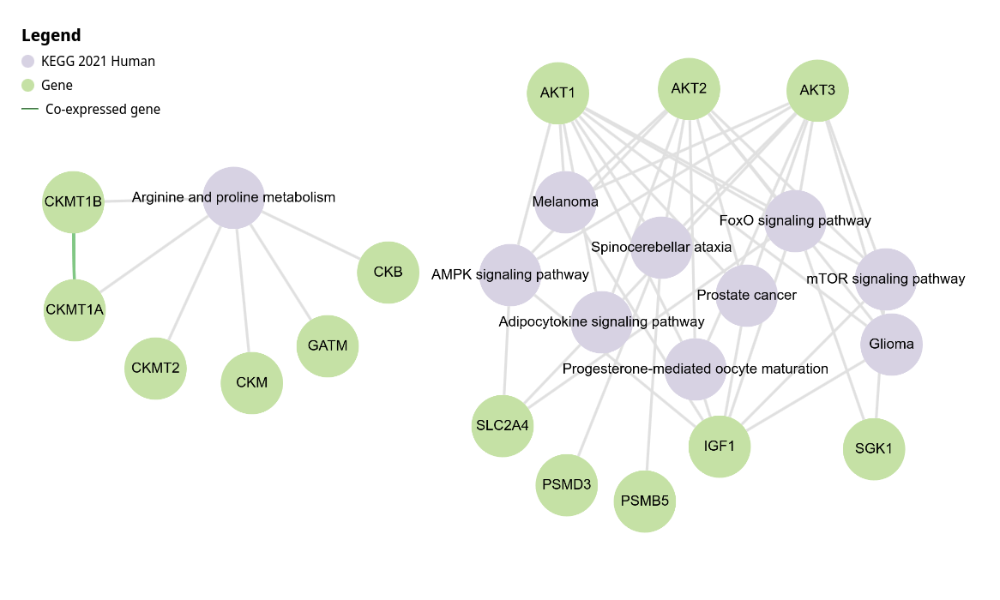

The KEGG classification did not retrieve any integration between genes of the creatine metabolism process and all the other retrieved process. The green lines represent the genes that are co-expressed.

#### Elsevier Pathway Collection

The results were similar to the previous ones. Again, overlap of the genes from AKT family.

| Term | P-value | adjusted P-value | OddsRatio | Combined Score | Genes |
|:---------:|:-------:|:----------------:|:---------:|:--------------:|:-----:|
|PI3K/AKT/MTOR Signaling Activation in Cancer | 3.442744264155221E-7 | 9.138563669603297E-5 | 305.6479591836735 | 4548.599973962004 | AKT2;AKT3;AKT1 |
|Proteins Involved in Insulin Resistance | 5.707296999774423E-7 | 9.138563669603297E-5 | 79.54445554445554 | 1143.5589429676934 | AKT2;AKT1;SLC2A4;IGF1 |
|mTOR Signaling | 5.707296999774423E-7 | 9.138563669603297E-5 | 79.54445554445554 | 1143.5589429676934 | AKT1;SLC2A4;IGF1;SGK1 |
|Dexamethasone Induced Diabetes | 6.719532110002424E-7 | 9.138563669603297E-5 | 237.67857142857142 | 3378.1438667537373 | AKT1;SLC2A4;SGK1 |
|PI3K/AKT/MTOR Signaling Activation by Blocking of Tumor Suppressors | 1.15959377718675E-6 | 1.261638029579184E-4 | 194.42532467532467 | 2657.2966162374837  |AKT2;AKT3;AKT1 |
|Myostatin-IGF1 Crosstalk in Skeletal Muscles in Muscular Dystrophies | 2.4915350814739284E-6 | 2.1287904870031856E-4 | 147.44334975369458 | 1902.4042658603282 |AKT1;|SLC2A4;IGF1 |
|IGF1 Role in Muscle Hypertrophy | 2.7392524648938054E-6 | 2.1287904870031856E-4 | 142.52142857142857 | 1825.3895868426932 | AKT1;SLC2A4;IGF1 |
|Glucocorticoids in Insulin Resistance in Skeletal Muscles | 3.2825551383464033E-6 | 2.2321374940755543E-4 | 133.60044642857142 | 1686.9579316849192 | AKT1;SLC2A4;SGK1 |
|mTOR Signaling Hyperfunction | 8.615629850848899E-6 | 5.207669598735334E-4 | 94.94285714285714 | 1107.217198924578 | AKT1;IGF1;SGK1 |
|Proteins with Altered Expression in Cancer-Associated Sustaining of Proliferative Signaling | 1.2331668345829871E-5 | 6.708427580131449E-4 | 35.64912280701754 | 402.9541537249656 | AKT2;AKT3;AKT1;IGF1 |

The clustergram also evidences that AKT1 is involved in all significant associated terms:

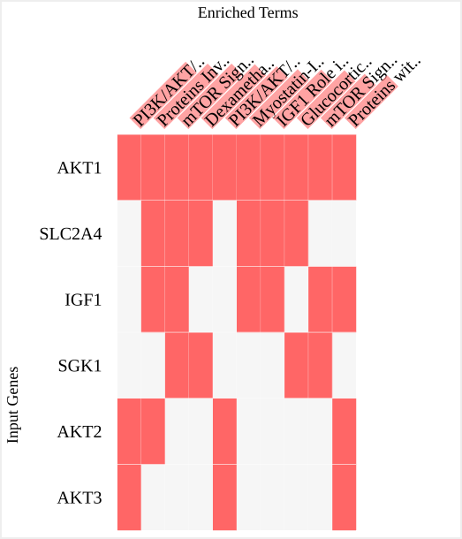

#### Regulation by kinases

We chose three datasets to investigate regulation by kinases.

For the ARCHS4_Kinases dataset, which describe coexpression with several kinases, we obtained the following results:

| Term | P-value | adjusted P-value | OddsRatio | Combined Score | Genes |
|:---------:|:-------:|:----------------:|:---------:|:--------------:|:-----:|
| STK25 human kinase ARCHS4 coexpression | 9.992190247741576E-5 | 0.008343478856864216 | 20.535071707953065 | 189.15104364111238 | CKMT2;CKM;PSMD3;AKT1 |
| CDK16 human kinase ARCHS4 coexpression | 9.992190247741576E-5 | 0.008343478856864216 | 20.535071707953065 | 189.15104364111238 | SLC6A8;AKT2;PSMD3;AKT1 |
| DMPK human kinase ARCHS4 coexpression | 0.001925573805929655 | 0.024736217353096338 | 14.252171814671815 | 89.11215000302461 | CKMT2;CKM;AKT2 |
| MAST2 human kinase ARCHS4 coexpression | 0.001925573805929655 | 0.024736217353096338 | 14.252171814671815 | 89.11215000302461 | CKMT2;CKM;AKT1 |
| PRKACA human kinase ARCHS4 coexpression | 0.001925573805929655 | 0.024736217353096338 | 14.252171814671815 | 89.11215000302461 | CKMT2;CKM;AKT1 |
| ABL1 human kinase ARCHS4 coexpression | 0.001925573805929655 | 0.024736217353096338 | 14.252171814671815 | 89.11215000302461 | SLC6A8;PSMD3;AKT1 |
| STK11 human kinase ARCHS4 coexpression | 0.001925573805929655 | 0.024736217353096338 | 14.252171814671815 | 89.11215000302461 | AKT2;PSMD3;AKT1 |
| TNK1 human kinase ARCHS4 coexpression | 0.001925573805929655 | 0.024736217353096338 | 14.252171814671815 | 89.11215000302461 | CKMT1A;AKT1;CKMT1B |
| EIF2AK1 human kinase ARCHS4 coexpression | 0.001925573805929655 | 0.024736217353096338 | 14.252171814671815 | 89.11215000302461 | SLC6A8;PSMD3;AKT1 |
| GSK3A human kinase ARCHS4 coexpression | 0.001925573805929655 | 0.024736217353096338 | 14.252171814671815 | 89.11215000302461 | AKT2;PSMD3;AKT1 |

Using these kinases symbols, together with the starting gene list, we collected the general tissue expression profiles from the GTex Portal. Interestingly, the expression of these genes in kidney and pancreas cluster together.

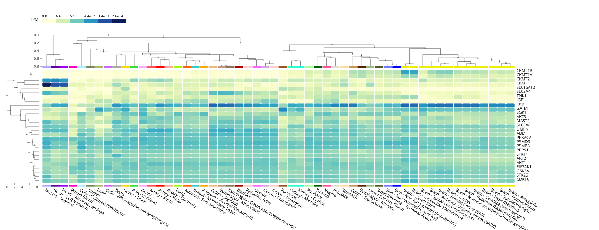
GTex expression profiles for the creatine-related genes together with kinases - All tissues.

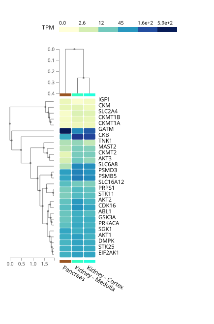
GTex expression profiles for the creatine-related genes together with kinases - Kidney and Pancreas tissues.

We also searched against the dataset [Kinase Library 2023](https://kinase-library.mit.edu/home). The results are described in the file [The_Kinase_Library_2023_table.txt](tables-Enrich/The_Kinase_Library_2023_table.txt). In this new results we observed additional kinases directly related to proteins of the creatine metabolism, such as CKB, CKM and CKMT1.

| Term | P-value | adjusted P-value | OddsRatio | Combined Score | Genes |
|:---------:|:-------:|:----------------:|:---------:|:--------------:|:-----:|
| CAMKK2 | 5.125942179754265E-4 | 0.022482293685173876 | 9.602888086642599 72.75173004896666 | SLC6A8;AKT2;AKT3;AKT1;CKB |
| MEK2 | 5.651178823731518E-4 | 0.022482293685173876 | 9.390459363957596 | 70.22632692814807 | CKM;AKT2;AKT3;AKT1;SGK1 |
| VRK1 | 6.548240879176856E-4 | 0.022482293685173876 | 9.077347016343596 | 66.54733744727787 | CKM;AKT2;AKT3;AKT1;SGK1 |
| PDHK4 | 0.0038968095151162767 | 0.08545734549852911 | 7.46552562481766 | 41.41572855778749 | AKT2;AKT3;AKT1;SGK1 |
| PLK4 | 0.004148414830025685 | 0.08545734549852911 | 7.3303392259914 | 40.20712313453663 CKM;AKT2;AKT3;AKT1 |
| PDK1 | 0.005872262249694354 | 0.08847744264005385 | 6.616424116424116 | 3.991980312135105 | AKT2;AKT3;AKT1;SGK1 |
| DMPK1 | 0.006013030082333757 | 0.08847744264005385 | 6.56995353639649 | 3.597602393431934 | CKMT2;CKM;AKT1;CKB |
| AAK1 | 0.023617828209109744 | 0.1592957450548465 | 5.564488143435512 | 20.84320049135658 | CKMT2;CKM;CKB |
| TBK1 | 0.024624843228191095 | 0.1592957450548465 | 5.472396129766648 | 20.26975230032503 | CKM;AKT2;SLC2A4 |
| GAK | 0.025309233574566194 | 0.1592957450548465 | 5.412614980289093 | 19.899944386363845 | CKMT2;CKM;CKB |
| NEK7 | 0.025395516635510477 | 0.1592957450548465 | 5.405230596175478 | 19.854399142153525  | CKMT2;CKMT1A;CKMT1B |
| PBK  | 0.025481962898088663 | 0.1592957450548465 | 5.3978655682456465 | 19.809002933529143 | CKMT2;CKM;CKB |
| BIKE | 0.0261794093655069 | 0.1592957450548465 | 5.339633129516398 | 19.45111987412097 | CKMT2;CKM;CKB |
| MASTL | 0.026355403573110305 | 0.1592957450548465 | 5.325263352430235 | 19.363093985816114 | CKM;AKT2;AKT3 |
| VRK2 | 0.02796874656539955 | 0.1592957450548465 | 5.199205345855156 | 18.59582923508135 | SLC6A8;PSMB5;CKM |

The next figure describes the network obtained with the top 10 rated results:

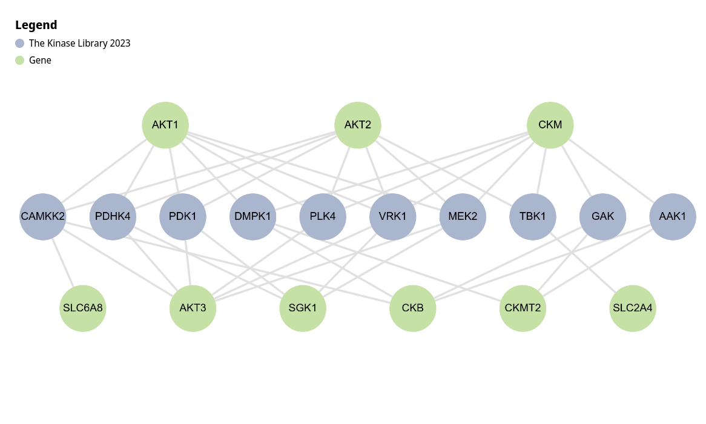

#### Kinase pertubartions from GEO

From these datasets we identified the genes from our list that up or downregulated in GEO datasets that have kinase perturbations, like mutants lines, overexpression, etc.

The kinase-perturbation upregulated associated genes were:

| Kinase/perturbation | GEO Entry | P-value | adjusted P-value | OddsRatio | Combined Score | Upregulated Genes |
|:---------:|:-------:|:-------:|:----------------:|:---------:|:--------------:|:-----:|
| IRAK4 defectivemutant 200 | [GSE6789](https://www.ncbi.nlm.nih.gov/geo/query/acc.cgi?acc=GSE6789) | 1.0121923535514024E-4 | 0.007996319593056078 | 20.464656964656964 | 188.23845272683081 | AKT3;SLC16A12;IGF1;CKB |
| HIPK2 knockout 171 | [GSE39253](https://www.ncbi.nlm.nih.gov/geo/query/acc.cgi?acc=GSE39253) | 0.001944001714153394 | 0.051192045139372706 | 14.203463203463203 | 88.67231581712312 | PSMD3;IGF1;CKB |
| MAP2K4 knockdown 62 | [GSE19091](https://www.ncbi.nlm.nih.gov/geo/query/acc.cgi?acc=GSE19091) | 0.001944001714153394 | 0.051192045139372706 | 14.203463203463203 | 88.67231581712312 | PRPS1;GATM;PSMB5 |
| AKT1 activemutant 10 | [GDS2304](https://www.ncbi.nlm.nih.gov/geo/query/acc.cgi?acc=GDS2304) | 0.026291292253072487 | 0.14835800628519477 | 8.807606263982104 | 32.04662941593047 | AKT1;CKB |
| AKT1 activemutant 9 | [GDS2304](https://www.ncbi.nlm.nih.gov/geo/query/acc.cgi?acc=GDS2304) | 0.026291292253072487 | 0.14835800628519477 | 8.807606263982104 | 32.04662941593047 | AKT1;CKB |
| HIPK2 knockdown 106 | [GSE27869](https://www.ncbi.nlm.nih.gov/geo/query/acc.cgi?acc=GSE27869) | 0.026291292253072487 | 0.14835800628519477 | 8.807606263982104 | 32.04662941593047 | PRPS1;PSMD3 |
| EGFR drugactivation 19 | [GDS2146](https://www.ncbi.nlm.nih.gov/geo/query/acc.cgi?acc=GDS2146) | 0.026291292253072487 | 0.14835800628519477 | 8.807606263982104 | 32.04662941593047 | PRPS1;SGK1 |
| FGFR1 activemutant 58 | [GSE17916](https://www.ncbi.nlm.nih.gov/geo/query/acc.cgi?acc=GSE17916) | 0.026291292253072487 | 0.14835800628519477 | 8.807606263982104 | 32.04662941593047 | CKMT2;PSMD3 |
| MET knockout 247 | [GDS3148](https://www.ncbi.nlm.nih.gov/geo/query/acc.cgi?acc=GDS3148) | 0.026291292253072487 | 0.14835800628519477 | 8.807606263982104 | 32.04662941593047 | IGF1;SGK1 |
| ROCK2 knockdown 157 | [GSE34769](https://www.ncbi.nlm.nih.gov/geo/query/acc.cgi?acc=GSE34769) | 0.026291292253072487 | 0.14835800628519477 | 8.807606263982104 | 32.04662941593047 | CKB;SGK1 |

And the downregulated ones were:

| Kinase/perturbation | GEO Entry | P-value | adjusted P-value | OddsRatio | Combined Score | Downregulated Genes |
|:---------:|:-------:|:-------:|:----------------:|:---------:|:--------------:|:-----:|
| AKT1 activemutant 9 | [GDS2304](https://www.ncbi.nlm.nih.gov/geo/query/acc.cgi?acc=GDS2304) | 1.0121923535514024E-4 | 0.008806073475897201 | 20.464656964656964 | 188.23845272683081 | SLC6A8;AKT2;AKT3;SLC2A4 |
| KSR1 knockout 126 | [GSE28228](https://www.ncbi.nlm.nih.gov/geo/query/acc.cgi?acc=GSE28228) | 0.001944001714153394 | 0.08456407456567264 | 14.203463203463203 | 88.67231581712312 | PRPS1;PSMB5;SGK1 |
| MYLK knockdown 48 | [GSE14525](https://www.ncbi.nlm.nih.gov/geo/query/acc.cgi?acc=GSE28228) | 0.026291292253072487 | 0.15248949506782042 | 8.807606263982104 | 32.04662941593047 | PSMB5;AKT1 |
| TGFBR2 knockout 295 | [GSE45968](https://www.ncbi.nlm.nih.gov/geo/query/acc.cgi?acc=GSE45968) | 0.026291292253072487 | 0.15248949506782042 | 8.807606263982104 | 32.04662941593047 | PRPS1;AKT2 |
| TRIM28 knockout 302 | [GSE32224](https://www.ncbi.nlm.nih.gov/geo/query/acc.cgi?acc=GSE32224) | 0.026291292253072487 | 0.15248949506782042 | 8.807606263982104 | 32.04662941593047 | CKMT2;AKT3 |
| PRKACB knockdown 91 | [GSE27869](https://www.ncbi.nlm.nih.gov/geo/query/acc.cgi?acc=GSE27869) | 0.026291292253072487 | 0.15248949506782042 | 8.807606263982104 | 32.04662941593047 | IGF1;SGK1 |
| PLK2 knockdown 87 | [GSE27869](https://www.ncbi.nlm.nih.gov/geo/query/acc.cgi?acc=GSE27869) | 0.026291292253072487 | 0.15248949506782042 | 8.807606263982104 | 32.04662941593047 | AKT2;PSMD3 |
| MAP2K1 druginhibition 172 | [GSE39984](https://www.ncbi.nlm.nih.gov/geo/query/acc.cgi?acc=GSE39984) | 0.026291292253072487 | 0.15248949506782042 | 8.807606263982104 | 32.04662941593047 | SLC6A8;SGK1 |
| WEE1 druginhibition 307 | [GSE38972](https://www.ncbi.nlm.nih.gov/geo/query/acc.cgi?acc=GSE38972) | 0.026291292253072487 | 0.15248949506782042 | 8.807606263982104 | 32.04662941593047 | PRPS1;PSMB5 |
| PIK3CA knockdown 182 | [GSE46869](https://www.ncbi.nlm.nih.gov/geo/query/acc.cgi?acc=GSE46869) | 0.026291292253072487 | 0.15248949506782042 | 8.807606263982104 | 32.04662941593047 | PSMB5;SGK1 |

### Regulation by phosphatases

The dataset used for the evaluation of possible phosphatases-mediated regulation was Phosphatase Substrates from DEPOD. All of the retrieved phosphatases relate to the regulation of the genes from AKT family (AKT1, AKT2 and AKT3) associated to creatine metabolism.

| Term | P-value | adjusted P-value | OddsRatio | Combined Score | Genes |
|:---------:|:-------:|:----------------:|:---------:|:--------------:|:-----:|
| PHLPP1 | 1.0183823146040292E-8 | 2.545955786510073E-8 | 1427.142857142857 | 26262.94696623494 | AKT2;AKT3;AKT1 |
| PHLPP2 | 1.0183823146040292E-8 | 2.545955786510073E-8 | 1427.142857142857 | 26262.94696623494 | AKT2;AKT3;AKT1 |
| PPP2CA | 0.002493640221385313 | 0.004156067035642188 | 30.848062015503874 | 184.90364463692268 | AKT3;AKT1 |
| ACP1 | 0.012678709933633063 | 0.01584838741704133 | 89.14732142857143 | 389.38044082427126 | AKT1 |
| PPP1CA | 0.0384036388314902 | 0.03840363883149023 | 27.691666666666666 | 90.26384147630849 | AKT1 |

### Resultado enrichr-KG
The subnetwork shows the following associations: 
- **From Gene Ontology:** PSMB5, and PSMD3 belong to the biological process regulation of cellular amino acid metabolic process (GO:0006521). PSMB5, and PSMD3 belong to the biological process regulation of cellular ketone metabolic process (GO:0010565). SLC6A8, and GATM belong to the biological process creatine metabolic process (GO:0006600). PSMB5, and PSMD3 belong to the biological process regulation of cellular amine metabolic process (GO:0033238). PSMB5, and PSMD3 belong to the biological process negative regulation of cell cycle G2/M phase transition (GO:1902750).
- **From KEGG**: The gene products PSMB5, and PSMD3 are members of the KEGG pathway Proteasome. The gene products PSMB5, and PSMD3 are members of the KEGG pathway Huntington disease. The gene products PSMB5, and PSMD3 are members of the KEGG pathway Prion disease. The gene products PSMB5, and PSMD3 are members of the KEGG pathway Parkinson disease. The gene products PSMB5, and PSMD3 are members of the KEGG pathway Spinocerebellar ataxia.
- **From Jensen lab:** The disease Arts syndrome is associated with the gene PRPS1. The disease Intellectual disability is associated with the genes SLC6A8, and PRPS1. The disease Gyrate atrophy is associated with the gene GATM. The disease Purine nucleoside phosphorylase deficiency is associated with the gene PRPS1. The disease AGAT deficiency is associated with the gene SLC6A8. 
- **From DisGeNET:** The disease Mammary Carcinoma, Animal is associated with the following genes: SGK1, and GATM. The disease Drug Resistant Epilepsy is associated with the following genes: SLC6A8, and SGK1. The disease Congenital pes cavus is associated with the following genes: SLC6A8, and PRPS1. The disease Neonatal Hypotonia is associated with the following genes: SLC6A8, and PRPS1. The disease Creatine deficiency, X-linked is associated with the following genes: SLC6A8, and GATM.

## Analysis of Datasets

We did not find specific datasets that evaluated the creatine-treatment on renal tissues from human organism or cells. Therefore, we restricted our search for datasets that evaluated specific kidney diseases.

### Kidney baseline expression

As previously noticed, kidney tissues highly express the following genes:

```
CKB
PRPS1
AKT3
SLC16A12
CKMT2
GATM
SGK1
AKT1
AKT2
PSMB5
SLC6A8
PSMD3
```

### GEO Profiles of Creatine-related genes

We started a search within the the [GeoProfiles Database}(https://www.ncbi.nlm.nih.gov/geoprofiles) using each gene symbol as main search term, using the following criteria:
- Organism: *Homo sapiens*.
- Differential expression: Up/down genes.
- DataSet keyword: Kidney and/or Renal.
- Exclusion criteria: expression undetected, experimental design not comparing disease/metabolic/chemical treatment conditions or with mutants cell lines.
We then merged the results, excluded any "renal" name variations (i.e. adrenal), and counted the overlapped profiles.

The results per gene will be discussed bellow.

#### GATM

Using the aforementioned criteria, we obtained 16 distinct profiles for the GATM gene (9 for kidney, 10 for renal, 3 registers were present in both - marked with an *).

##### 1. Nephrosclerosis: glomeruli (GDS3712 / 216733_s_at)*

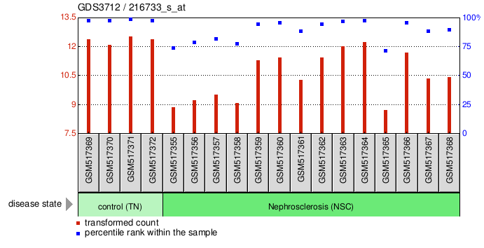

From the GEO-generated graph we can perceive a significative downregulation of the gene GATM from Nephrosclerosis samples, when compared to the control ones.

##### 2. Renal clear cell carcinoma (HG-U133A) - GDS505*

Two profiles for the gene GATM:
 2.1. GDS505 / 203178_at*

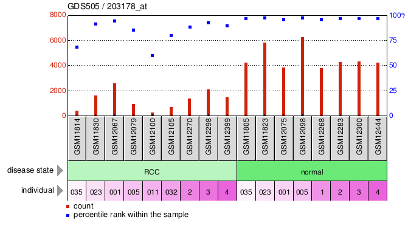

 2.2. GDS505 / 216733_s_at*

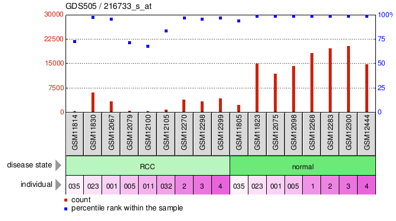

Both transcripts for GATM were downregulated when compared renal clear cell carcinomas (RCCs) versus control samples.

##### 3. Kidney transplant rejection expression profiling (GDS724 / 36596_r_at)

Two profiles for the gene GATM:

3.1. GDS724 / 36596_r_at

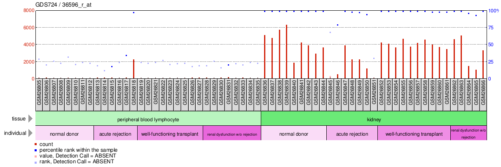

3.2. GDS724 / 36595_s_at

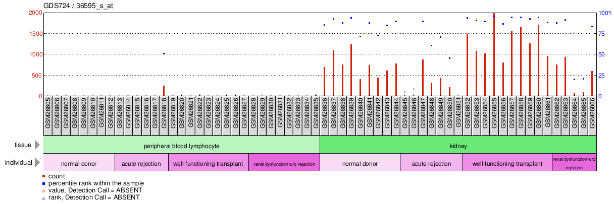

Interestingly, Normal-donors kidney tissues have higher expression of the gene GATM. The downregulation of this genes seems to be associated with acute transplant rejection and renal disfunction without transplant rejection.

>*Note that the expression of the periphreal blood lymphocytes is included in the gene-profile plots above.*

##### 4. Pancreatic beta cells and panel of primary tissues - GDS3983 / 216733_s_at

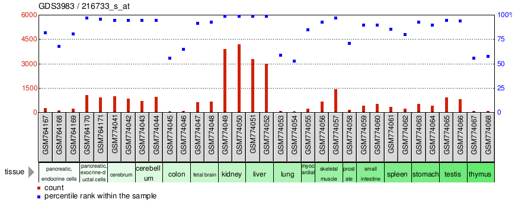

The gene expression profile above confirms the higher expression of GATM gene when compared to several other human tissues.

##### 5. Normal human tissue expression profiling (HG-U95A) - GDS422 / 36595_s_at

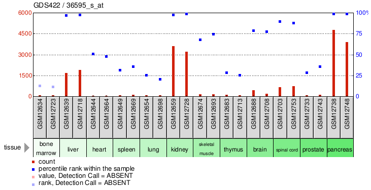

Another confirmation of the high expression of GATM in kidney and pancreas tissues.

##### 6. Normal human tissue expression profiling (HG-U95A) - GDS181 

Another two profiles for the same spot_IDs.

6.1. GDS181 / 36595_s_at

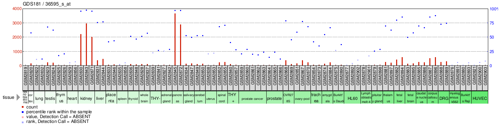

6.2. GDS181 / 36596_r_at

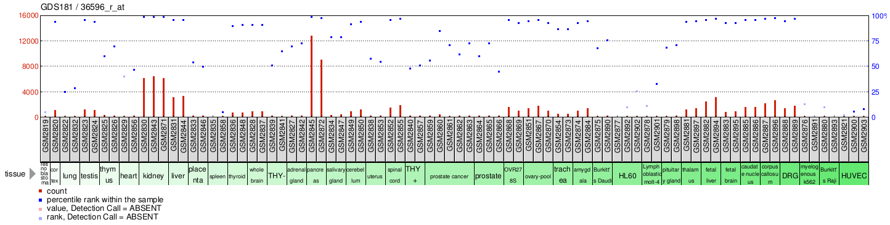

High expression of GATM from renal and pancreatic tissues.

##### 7. Chromophobe renal cell carcinoma and oncocytoma - GDS3274 / 203178_at

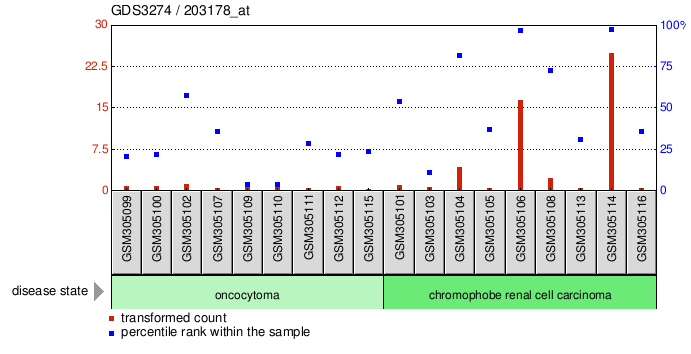

Chromophobe renal cell carcinoma samples have a trend of increased GATM expression.

##### 8. Stearoyl-CoA desaturase 1 inhibition effect on clear cell renal cell carcinoma cell lines - GDS5094 / 203178_at

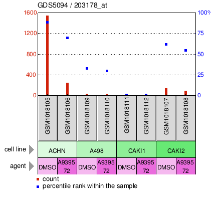

Only ACHN and CAKI2 ccRCC cells presented differential expression of the gene GATM. Interestingly, the Stearoyl-CoA desaturase 1 inhibitor treatment decreased significantly this expression, when compared to DMSO-treated ones (experiment controls).

##### 9. Papillary renal cell carcinoma classification

Two profiles for this study.

9.1. GDS1344 / 216733_s_at

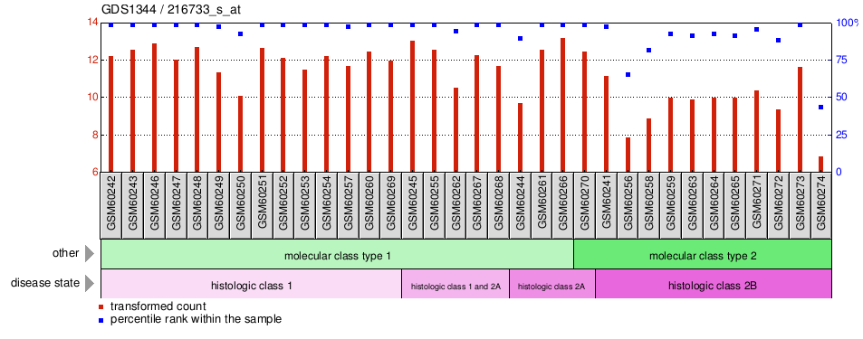

9.2. GDS1344 / 203178_at

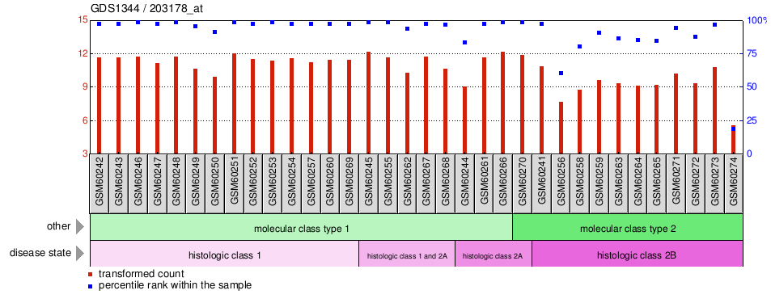

Histologic class 2B from Papillary renal cell carcinoma have a slightly downregulated expression of GATM when compared to the other types.

##### 10. Clear cell renal cell carcinoma (HG-U133A) - GDS2880 / 216733_s_at

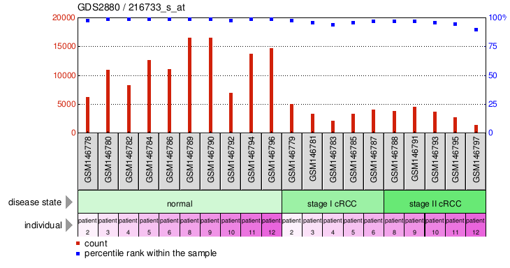

Normal cells have a higher expression of the GATM gene, whe compared to both tested stages of cRCC.

##### 11. Clear cell renal cell carcinoma (HB-U133B) - GDS2881 / 231686_at

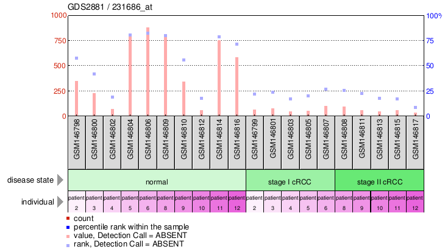

Same observation as the previous one.

#### CKB

With the above criteria, we retrieved just one profile for the gene CKB.

##### Hypoxia effect on a renal proximal tubule epithelial cell line - GDS3524 / 200884_at

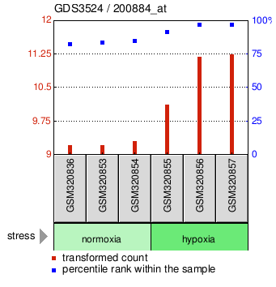

Renal proximal tubule epithelial cell lines have an increased expression of the gene CKB under hypoxia conditions, when compared to cells maintained under normoxic conditions.

#### PRPS1 - phosphoribosyl pyrophosphate synthetase 1

Two profiles were retrieved for the gene PRPS1, however just one from kidney samples. The other one was for whole peripheral blood samples and was not included in our study.

##### Hypoxia effect on von Hippel Lindau-overexpressing renal cell carcinoma cells - GDS5810 / 8169240

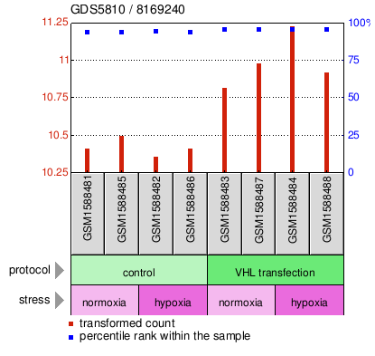

VHL-transfection submitted samples presented increased expression of the PRPS1 gene.

#### AKTs (AKT1, AKT2, and AKT3)

##### AKT1 and AKT2

No results within the search criteria.

##### AKT3

One result within the expression criteria.

###### NCI60 cancer cell lines - GDS1761 / 7808

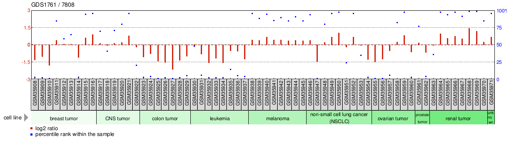

Significant upregulated expression of AKT3 on renal tumor samples.

#### SLC16A12 - solute carrier family 16 member 12

Just one result within thesolute carrier family 6 member 8 inclusion criteria.

##### Normal human tissue expression profiling (HG-U95D) - GDS425 / 80010_at

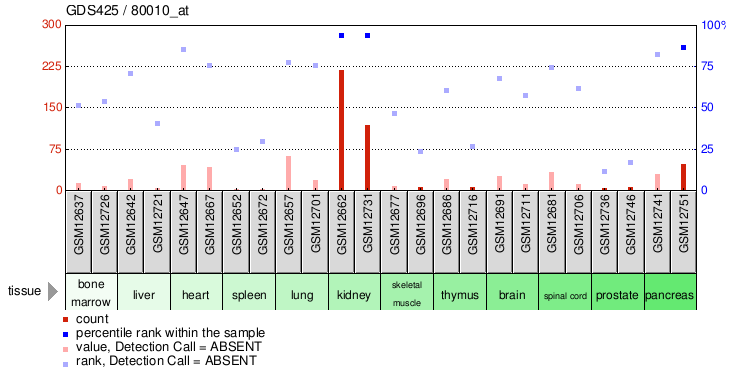

High expression of SLC16A12 in kidney tissues.

#### CKMT2 - creatine kinase, mitochondrial 2

##### Renal clear cell carcinoma (HG-U133A) - GDS505 / 205295_at

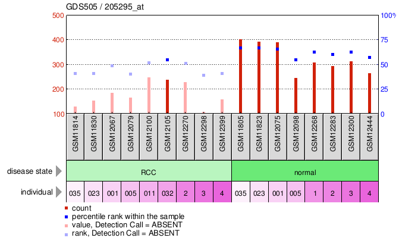

Normal cells have increased expression of the gene CKMT2 when compared to cRCC samples.

#### SGK1 - serum/glucocorticoid regulated kinase 1

##### NCI60 cancer cell lines

- GDS1761 / 3304:

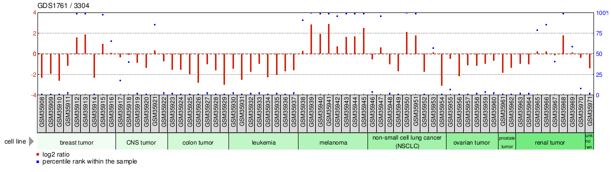

- GDS1761 / 8191:
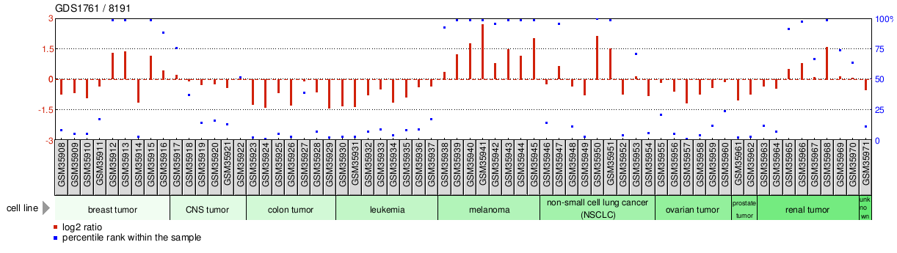

No significant differential expression from renal tumors.

##### Renal clear cell carcinoma (HG-U133A) - GDS505 / 201739_at

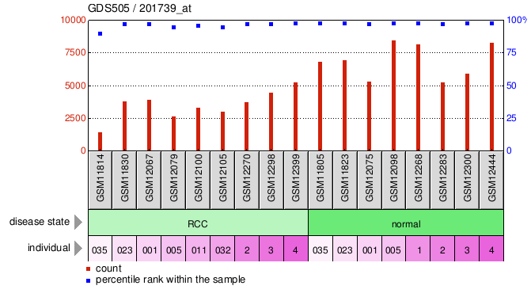

##### Clear cell renal cell carcinoma (HG-U133A) - GDS2880 / 201739_at

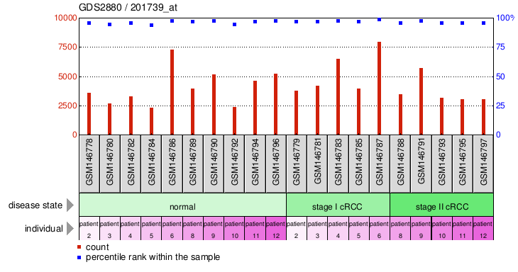

No differential expression among the samples.

#### PSMB5 - proteasome subunit beta 5

No results retrieved within the search criteria.

#### SLC6A8

No results retrieved within the search criteria. More on that later.

#### PSMD3

No results retrieved within the search criteria.

## Analysis of Specific Datasets

### Nephrosclerosis

The dataset [GDS3712](https://www.ncbi.nlm.nih.gov/sites/GDSbrowser?acc=GDS3712) and the series [GSE20602](https://www.ncbi.nlm.nih.gov/geo/query/acc.cgi?acc=GSE20602) are from renal biopsy specimens from 14 patients with nephrosclerosis (NSC) and four tumor-free kidney specimens from patients undergoing tumor nephrectomy (TN), which served served as controls [Neusser et al. 2010](https://pubmed.ncbi.nlm.nih.gov/20019191/). The *functional annotation analysis revealed significant regulation of hypoxia-associated biological processes in NSC, including angiogenesis, fibrosis, and inflammation. The glomerular expression levels of a majority of genes regulated by the hypoxia-inducible factors (HIFs) were significantly altered in NSC*<sup>Summarized by Generative AI</sup>. We analyzed the expression values from the creatine-related gene list using the R packages, [GEOquery](https://bioconductor.org/packages/release/bioc/html/GEOquery.html) and [limma](https://bioconductor.org/packages/release/bioc/html/limma.html). Then, the expression values were represented in a heatmap, constructed using the R package [pheatmap](https://www.rdocumentation.org/packages/pheatmap/versions/1.0.12/topics/pheatmap). We used the following cutoffs: P-value <= 0.05 and LogFC <= 1.

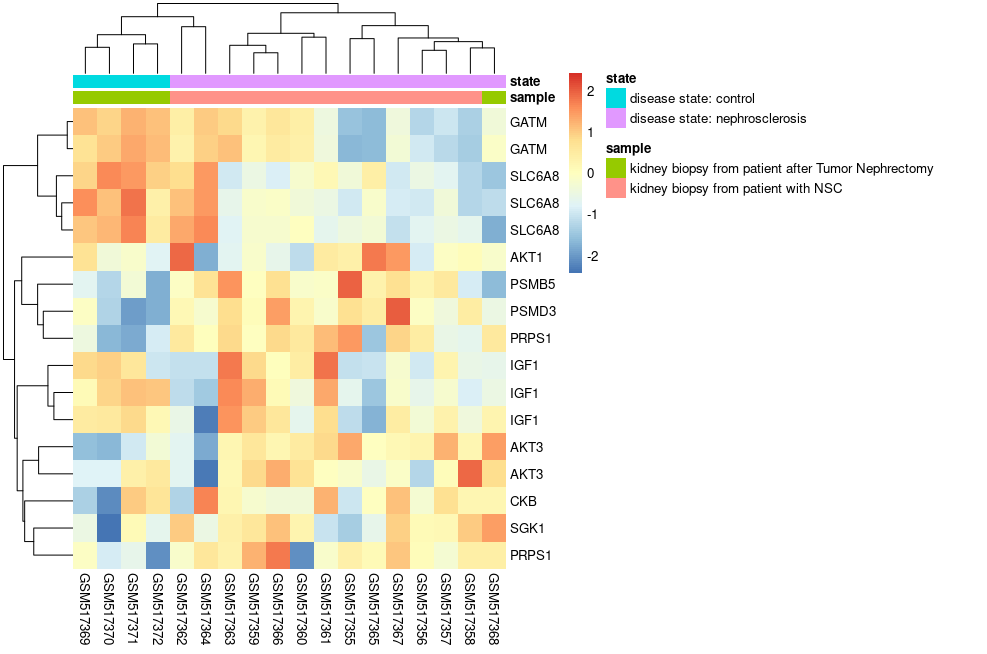

Ten of the initial 17 creatine-related had significative differentiall expression in the above dataset. The genes represented were:
- GATM - 2 trasncript isoforms.
    - [X86401](https://ncbi.nlm.nih.gov/nuccore/X86401.1?report=genbank) - UniprotID [P50440](https://www.uniprot.org/uniprotkb/P50440/entry), highly expressed in kidney tissues.
    - [NM_001482](https://ncbi.nlm.nih.gov/nuccore/NM_001482) - Precursor with the transit peptide.
- SLC6A8 - 3 transcript isoforms.
    - [NM_005629.4](https://ncbi.nlm.nih.gov/nuccore/NM_005629) - Homo sapiens solute carrier family 6 member 8 (SLC6A8), transcript variant 1, mRNA.
    - [U17986](https://ncbi.nlm.nih.gov/nuccore/U17986) - Seems to be a highly similar protein, the Human GABA/noradrenaline transporter.
    - [AW276522](https://ncbi.nlm.nih.gov/nuccore/AW276522) - SW:NTCS_HUMAN P53796 SODIUM- AND CHLORIDE-DEPENDENT CREATINE TRANSPORTER 2 - Obsolete entry in UNIPROT.
- IGF1 - 3 transcript isoforms.
    - [AU144912](https://ncbi.nlm.nih.gov/nuccore/M29644) - [AAA52543.1](https://ncbi.nlm.nih.gov/protein/183120).
    - [AI972496](https://ncbi.nlm.nih.gov/nuccore/AI972496) - wr38c02.x1 NCI_CGAP_Pr28 Homo sapiens cDNA clone IMAGE:2489954 3' similar to gb:X57025_rna1 INSULIN-LIKE GROWTH FACTOR IA PRECURSOR (HUMAN). *Seems to be prostate-specific.*
    - [M29644](https://ncbi.nlm.nih.gov/nuccore/M29644) - [AAA52543.1](https://ncbi.nlm.nih.gov/protein/183120).
- AKT3 - 2 transcript isoforms.
    - Both of them seem deprecated.
- PRPS1 - 2 transcript isoforms.
    - [BC001605](https://ncbi.nlm.nih.gov/nuccore/BC001605).
    - [NM_002764](https://ncbi.nlm.nih.gov/nuccore/NM_002764).
- AKT1, CKB, SGK1, PSMD3 and PSMB5 - one transcript isoform.
    - AKT1 - [NM_005163](https://ncbi.nlm.nih.gov/nuccore/NM_005163).
    - CKB - [NM_001823](https://ncbi.nlm.nih.gov/nuccore/NM_001823).
    - SGK1 - [NM_005627](https://ncbi.nlm.nih.gov/nuccore/NM_005627).
    - PSMD3 - [NM_002809](https://ncbi.nlm.nih.gov/nuccore/NM_002809).
    - PSMB5 - [BC004146](https://ncbi.nlm.nih.gov/nuccore/BC004146) - chimeric clone.

TN samples have an upregulated expression of transcript isoforms of GATM and SLC6A8 genes, when compared to NSC samples. As previously described, GATM encodes the enzyme Glycine Amidinotransferase, which plays a crucial role in creatine biosynthesis. Furthermore The SLC6A8 codes the **sodium- and chloride-dependent creatine transporter 1**, responsible for the creatine-transport into cells [REF](https://medlineplus.gov/genetics/gene/slc6a8/). The transcriptional upregulation of this gene under hypoxic conditions was previously reported [REF](https://www.genecards.org/cgi-bin/carddisp.pl?gene=SLC6A8). The increased creatine production promotes survival by maintaining redox homeostasis in hypoxic cells [REF](https://jeccr.biomedcentral.com/track/pdf/10.1186/s13046-021-01933-7.pdf). The reduced AOS accumulation could lead to an activation og the AKT-ERK signaling, which protects the viability of hypoxic cells. Therefore, it seems that nephrosclerosis patients may have a reduced creatine production and accumulation in the cell. In addition, this may also explain the relationship between creatine accumulation and members of the AKT gene family.

### Rejection after kidney transplant

We analyzed the expression series [GDS1563](https://www.ncbi.nlm.nih.gov/geo/query/acc.cgi?acc=GSE1563), from the dataset [GDS724](https://www.ncbi.nlm.nih.gov/sites/GDSbrowser?acc=GDS724). The experiment evaluated kidney biopsies expression profiles after transplant, unique to rejection (AR samples), dysfunction without rejection (NR samples), and well-functioning transplants (TX Samples). For our analyses, we excluded the samples extracted from lymphocytes